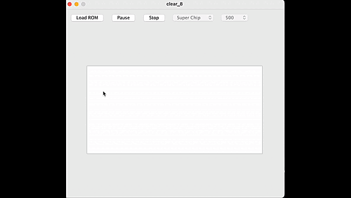

An emulator that interpretes and runs [CHIP-8](https://en.wikipedia.org/wiki/CHIP-8) games, with a simple useful interface.
 It has a **clea**-n and **r**-eadable object-oriented architecture.

Table of Contents
=================
* [About](#about)
* [Goals](#goals)
* [Usage](#usage)
* [Controls](#controls)
* [Public Domain Games](#public-domain-games)

About
-----
**This is still a bug-ridden hobby project, updated at a leisurely pace, 
 that is going to end up really nice some day :-)**

I abandoned it three years ago, and now revived it as my weekend project.

It's main purposes are having fun and polishing my skills in programming, 
 software-engineering and project-management.

Goals
-----
- Usability
  - Satisfy users with a simple and useful GUI
- Compatibility
  - Implement widely used CPUs: Cosmac VIP and Super Chip
- Extendability and Maintainability
  - Easily extendable and maintainable
- Portability
  - No need for modification for different computer systems

Usage
-----
1. > java -jar ./dist/clear_8.jar
2. Click "Load ROM" to select and load a game

Controls
--------

The original keys

* 1 | 2 | 3 | C
* 4 | 5 | 6 | D
* 7 | 8 | 9 | E
* A | 0 | B | F

are mapped to

* 1 | 2 | 3 | 4
* Q | W | E | R
* A | S | D | F
* Y | X | C | V

for german keyboards :P

Public domain games
-------------------

https://www.zophar.net/pdroms/chip8.html

https://johnearnest.github.io/chip8Archive
